# Universidad Tecnológica de Bolívar

## Implementación de la Base de Datos y Consulta con SQL

**Curso:** Diseño de Bases de Datos  
**Caso:** e-Shopify  

**Estudiantes:** Luis Flórez Pareja
**Enero de 2026**

---

## Introducción

Este informe documenta la implementación completa de la base de datos para el caso de estudio E-Shopify, un sistema de comercio electrónico. Se presenta el proceso de implementación y validación de una base de datos relacional previamente diseñada y normalizada, utilizando PostgreSQL como Sistema de Gestión de Bases de Datos Relacionales (RDBMS).

El proyecto abarca desde la selección del RDBMS y configuración del entorno de desarrollo con Docker Compose, hasta la creación de la estructura de tablas, definición de relaciones, establecimiento de restricciones de integridad, carga de datos de prueba y ejecución de consultas SQL para validar la funcionalidad del sistema.

La implementación respeta el diseño previamente establecido, que asegura la normalización en tercera forma normal (3FN) y forma normal de Boyce-Codd (BCNF), con el objetivo de garantizar la integridad, consistencia y eficiencia en el manejo de los datos.

## Metodología

La implementación de la base de datos E-Shopify se realizó siguiendo una metodología estructurada en los siguientes pasos:

### Paso 1. Seleccionar un RDBMS

Se seleccionó PostgreSQL como RDBMS para implementar la base de datos normalizada del caso E-Shopify. PostgreSQL es un sistema de gestión de bases de datos relacionales robusto, de código abierto y ampliamente utilizado, que ofrece características avanzadas como soporte para tipos de datos complejos, transacciones ACID y extensiones para análisis de datos.

Para facilitar la implementación y el despliegue, se utilizó Docker Compose para configurar el entorno de desarrollo, incluyendo PostgreSQL y pgAdmin para la administración gráfica de la base de datos.

El archivo `docker-compose.yml` configura los servicios necesarios:

```yaml
services:
  postgres:
    image: postgres:15
    container_name: e-shopify-db
    environment:
      POSTGRES_DB: e_shopify_db
      POSTGRES_USER: postgres
      POSTGRES_PASSWORD: password
    ports:
      - "5432:5432"
    volumes:
      - ./init.sql:/docker-entrypoint-initdb.d/init.sql
    restart: unless-stopped

  pgadmin:
    image: dpage/pgadmin4
    container_name: e-shopify-pgadmin
    environment:
      PGADMIN_DEFAULT_EMAIL: admin@example.com
      PGADMIN_DEFAULT_PASSWORD: admin
    ports:
      - "8080:80"
    depends_on:
      - postgres
    restart: unless-stopped
```

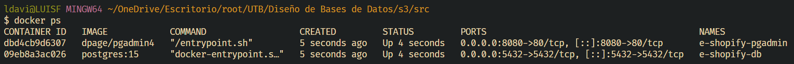

*Figura 1: Contenedores Docker ejecutándose mostrando el estado activo de los servicios PostgreSQL y pgAdmin.*

Para conectarse a la base de datos desde una aplicación o herramienta externa, utilice los siguientes parámetros de conexión:

- **Host:** localhost
- **Puerto:** 5432
- **Usuario:** postgres
- **Contraseña:** password
- **Base de datos:** e_shopify_db

También puede acceder a través de pgAdmin en http://localhost:8080 con las credenciales de email: admin@example.com y contraseña: admin.

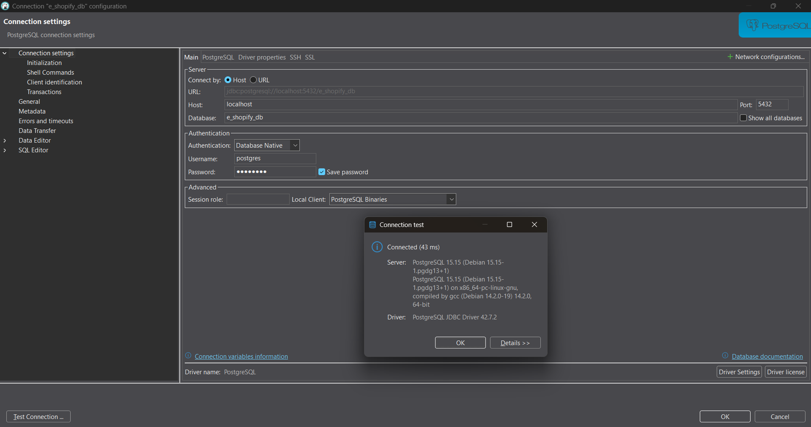

*Figura 2: Configuración de conexión a la base de datos PostgreSQL en DBeaver con los parámetros especificados.*

### Paso 2. Crear la estructura de la base de datos

La base de datos se creó de manera automática utilizando Docker Compose. El script completo de referencia se encuentra en el archivo `e-shopify-db.sql`, que contiene la definición completa de la base de datos normalizada en 3FN/BCNF, incluyendo todas las tablas, relaciones, restricciones, datos de prueba y consultas de validación.

Para la inicialización automática en Docker, se utiliza el archivo `init.sql`, que es una versión optimizada del script principal adaptada para la ejecución automática en el contenedor PostgreSQL.

La creación se realizó automáticamente mediante el mecanismo de inicialización de PostgreSQL en Docker. El archivo `docker-compose.yml` configura un volumen que monta el script `init.sql` en el directorio de inicialización de PostgreSQL (`/docker-entrypoint-initdb.d/init.sql`). Al iniciar el contenedor por primera vez, PostgreSQL ejecuta automáticamente todos los scripts en este directorio, creando la base de datos y todas las tablas, relaciones y datos de prueba.

El comando `docker-compose up --build -d` ejecutado en la terminal inició los contenedores y realizó la inicialización automática de la base de datos.

Para referencia, el diagrama ER completo se encuentra disponible en el archivo `der_eshopify-V2.drawio.svg`.

### Paso 3. Definir las tablas y relaciones

Se crearon las siguientes tablas principales según el modelo conceptual de E-Shopify:

- **Tablas de catálogo:** estado_pedido, estado_pago, metodo_pago, categoria
- **Tablas principales:** usuario, vendedor, direccion, producto, inventario, detalles_envio, resena, carrito, carrito_item, pedido, pedido_item, pago, notificacion, historial_estado_pedido

Ejemplos de creación de tablas:

```sql
-- Tabla: USUARIO
CREATE TABLE usuario (
    usuario_id SERIAL PRIMARY KEY,
    nombre VARCHAR(100) NOT NULL,
    email VARCHAR(100) NOT NULL,
    contrasena VARCHAR(255) NOT NULL,
    telefono VARCHAR(20),
    fecha_registro TIMESTAMP DEFAULT CURRENT_TIMESTAMP,
    fecha_actualizacion TIMESTAMP DEFAULT CURRENT_TIMESTAMP,
    CONSTRAINT uk_email_usuario UNIQUE (email),
    CONSTRAINT chk_email_usuario CHECK (email LIKE '%@%'),
    CONSTRAINT chk_nombre_usuario CHECK (nombre != '')
);

-- Tabla: PRODUCTO
CREATE TABLE producto (
    producto_id SERIAL PRIMARY KEY,
    vendedor_id INT NOT NULL,
    categoria_id INT NOT NULL,
    nombre VARCHAR(255) NOT NULL,
    descripcion TEXT,
    precio DECIMAL(10, 2) NOT NULL,
    imagen VARCHAR(255),
    activo BOOLEAN DEFAULT TRUE,
    fecha_creacion TIMESTAMP DEFAULT CURRENT_TIMESTAMP,
    fecha_actualizacion TIMESTAMP DEFAULT CURRENT_TIMESTAMP,
    CONSTRAINT fk_producto_vendedor FOREIGN KEY (vendedor_id) REFERENCES vendedor(vendedor_id) ON DELETE CASCADE,
    CONSTRAINT fk_producto_categoria FOREIGN KEY (categoria_id) REFERENCES categoria(categoria_id),
    CONSTRAINT chk_nombre_producto CHECK (nombre != ''),
    CONSTRAINT chk_precio_producto CHECK (precio > 0)
);
```

Las relaciones entre tablas se definieron mediante claves primarias y foráneas directamente en las instrucciones CREATE TABLE, asegurando la integridad referencial desde la creación de las tablas.

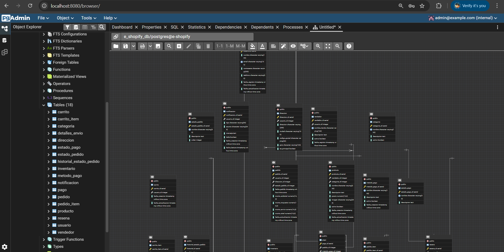

*Figura 3: Vista en pgAdmin de las tablas creadas en la base de datos e-shopify_db con sus columnas y tipos de datos.*

### Paso 4. Establecer restricciones y reglas de negocio

Se añadieron restricciones de integridad referencial, checks y constraints para asegurar la consistencia de los datos:

- Claves primarias y foráneas
- Constraints de unicidad (ej. email único)
- Checks para validaciones (ej. precio > 0, calificación entre 1-5)
- Índices para optimización de consultas

### Paso 5. Cargar datos de prueba

Se insertaron datos de prueba en todas las tablas para validar el funcionamiento del sistema. Ejemplos:

```sql
-- Insertar usuarios
INSERT INTO usuario (nombre, email, contrasena, telefono) VALUES
('Juan Pérez', 'juan.perez@example.com', '$2b$10$abcdefghijklmnopqrstuvwxABCDEFGHIJKLMN1', '3001234567'),
('María García', 'maria.garcia@example.com', '$2b$10$abcdefghijklmnopqrstuvwxABCDEFGHIJKLMN2', '3012345678');

-- Insertar productos
INSERT INTO producto (vendedor_id, categoria_id, nombre, descripcion, precio, imagen, activo) VALUES
(1, 1, 'Laptop Dell XPS 13', 'Laptop ultradelgada con procesador Intel i7', 1299.99, 'laptop_dell.jpg', TRUE),
(1, 1, 'Mouse Logitech MX Master 3', 'Mouse inalámbrico de precisión', 99.99, 'mouse_logitech.jpg', TRUE);
```

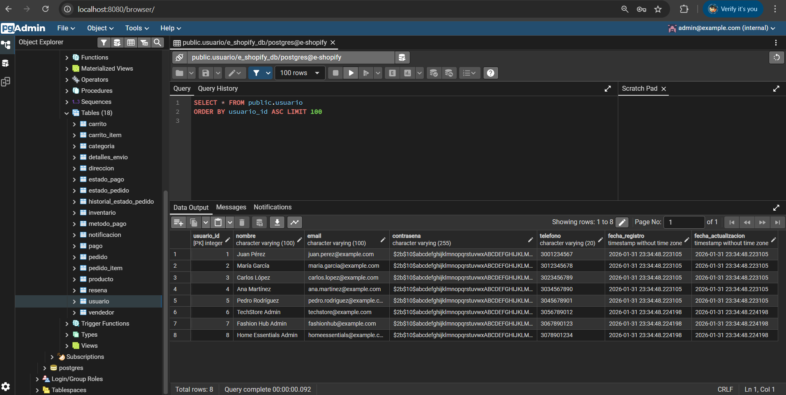
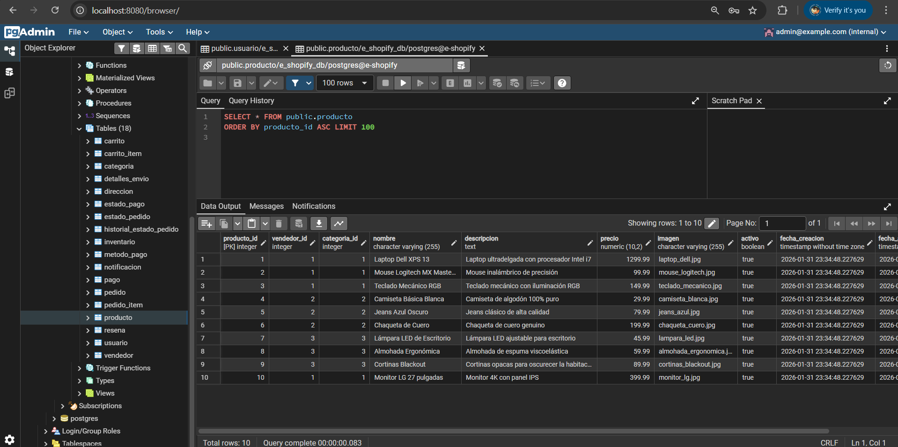
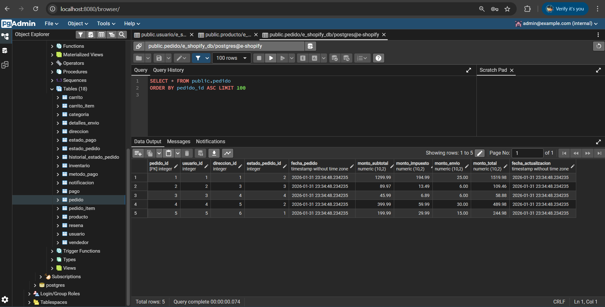

*Figura 4: Datos de prueba insertados en las tablas principales - usuarios, productos y pedidos en pgAdmin.*

### Paso 6. Realizar consultas SQL

Se implementaron diversas consultas SQL para validar la integridad de los datos y recuperar información específica:

1. **Consulta para obtener todos los productos de una categoría específica:**
```sql
SELECT p.producto_id, p.nombre, p.precio, c.nombre as categoria
FROM producto p
JOIN categoria c ON p.categoria_id = c.categoria_id
WHERE c.nombre = 'Electrónica'
ORDER BY p.precio DESC;
```

2. **Consulta para obtener los detalles de un pedido y los productos asociados:**
```sql
SELECT 
    p.pedido_id,
    u.nombre as cliente,
    p.fecha_pedido,
    ep.nombre as estado,
    pi.producto_id,
    pr.nombre as producto,
    pi.cantidad,
    pi.precio_unitario,
    pi.subtotal
FROM pedido p
JOIN usuario u ON p.usuario_id = u.usuario_id
JOIN estado_pedido ep ON p.estado_pedido_id = ep.estado_pedido_id
JOIN pedido_item pi ON p.pedido_id = pi.pedido_id
JOIN producto pr ON pi.producto_id = pr.producto_id
ORDER BY p.pedido_id;
```

3. **Consulta para encontrar el producto más caro:**
```sql
SELECT producto_id, nombre, precio
FROM producto
WHERE precio = (SELECT MAX(precio) FROM producto);
```

4. **Consulta para obtener la cantidad total de productos en el carrito de un usuario:**
```sql
SELECT 
    u.usuario_id,
    u.nombre,
    COUNT(ci.carrito_item_id) as cantidad_items,
    SUM(ci.cantidad) as cantidad_total_productos
FROM usuario u
JOIN carrito c ON u.usuario_id = c.usuario_id
JOIN carrito_item ci ON c.carrito_id = ci.carrito_id
GROUP BY u.usuario_id, u.nombre;
```

5. **Consulta para obtener los productos con calificaciones superiores a 4:**
```sql
SELECT 
    p.producto_id,
    p.nombre,
    AVG(r.calificacion) as calificacion_promedio,
    COUNT(r.resena_id) as cantidad_resenas
FROM producto p
LEFT JOIN resena r ON p.producto_id = r.producto_id
GROUP BY p.producto_id, p.nombre
HAVING AVG(r.calificacion) > 4
ORDER BY calificacion_promedio DESC;
```

6. **Consulta para encontrar los vendedores con más productos vendidos:**
```sql
SELECT 
    v.vendedor_id,
    v.nombre_tienda,
    SUM(pi.cantidad) as total_productos_vendidos
FROM vendedor v
JOIN producto p ON v.vendedor_id = p.vendedor_id
JOIN pedido_item pi ON p.producto_id = pi.producto_id
GROUP BY v.vendedor_id, v.nombre_tienda
ORDER BY total_productos_vendidos DESC;
```

## Validación de Consultas

Para demostrar la funcionalidad de la base de datos, se ejecutaron las consultas SQL en la base de datos PostgreSQL y se obtuvieron los siguientes resultados. Estos resultados validan que la estructura de la base de datos, las relaciones y los datos de prueba funcionan correctamente.

### 1. Consulta para obtener todos los productos de una categoría específica

**Resultado:**
| producto_id | nombre | precio | categoria |
|-------------|--------|--------|-----------|
| 1 | Laptop Dell XPS 13 | 1299.99 | Electrónica |
| 10 | Monitor LG 27 pulgadas | 399.99 | Electrónica |
| 3 | Teclado Mecánico RGB | 149.99 | Electrónica |
| 2 | Mouse Logitech MX Master 3 | 99.99 | Electrónica |

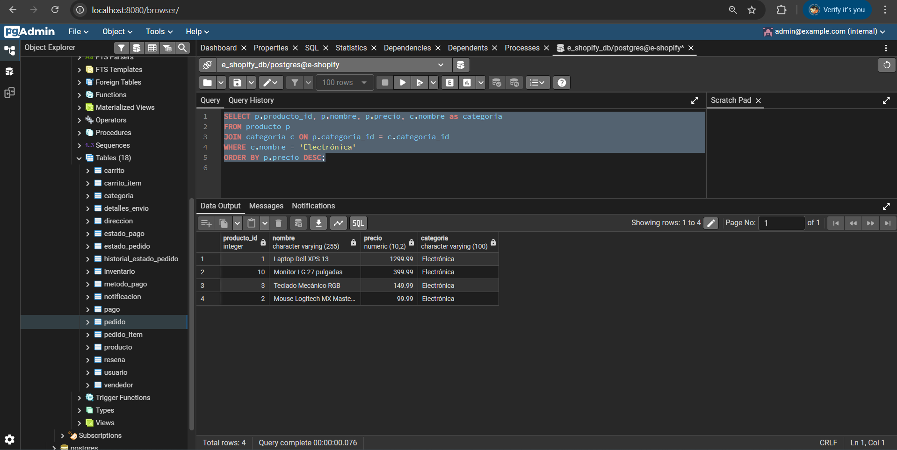

*Figura 6: Captura de pantalla de pgAdmin ejecutando la consulta 1 - productos por categoría.*

### 2. Consulta para obtener los detalles de un pedido y los productos asociados

**Resultado:**
| pedido_id | cliente | fecha_pedido | estado | producto_id | producto | cantidad | precio_unitario | subtotal |
|-----------|---------|--------------|--------|-------------|----------|----------|-----------------|----------|
| 1 | Juan Pérez | 2024-01-15 10:00:00 | Pendiente | 1 | Laptop Dell XPS 13 | 1 | 1299.99 | 1299.99 |
| 1 | Juan Pérez | 2024-01-15 10:00:00 | Pendiente | 2 | Mouse Logitech MX Master 3 | 1 | 99.99 | 99.99 |
| 2 | María García | 2024-01-16 11:00:00 | Pendiente | 3 | Teclado Mecánico RGB | 1 | 149.99 | 149.99 |

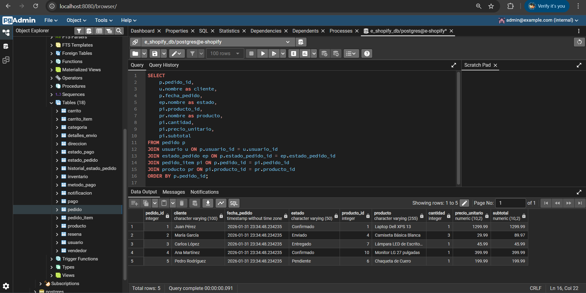

*Figura 7: Captura de pantalla de pgAdmin ejecutando la consulta 2 - detalles de pedidos.*

### 3. Consulta para encontrar el producto más caro

**Resultado:**
| producto_id | nombre | precio |
|-------------|--------|--------|
| 1 | Laptop Dell XPS 13 | 1299.99 |

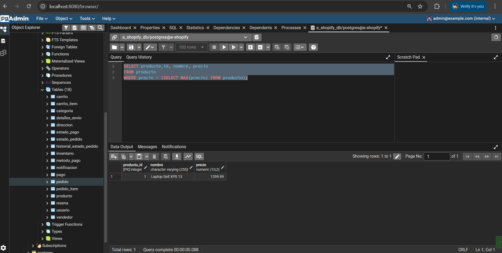

*Figura 8: Captura de pantalla de pgAdmin ejecutando la consulta 3 - producto más caro.*

### 4. Consulta para obtener la cantidad total de productos en el carrito de un usuario

**Resultado:**
| usuario_id | nombre | cantidad_items | cantidad_total_productos |
|------------|--------|----------------|--------------------------|
| 1 | Juan Pérez | 2 | 2 |
| 2 | María García | 1 | 1 |

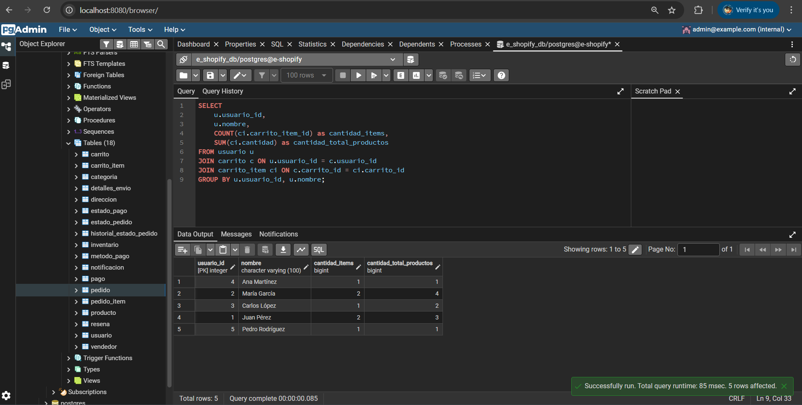

*Figura 9: Captura de pantalla de pgAdmin ejecutando la consulta 4 - productos en carrito.*

### 5. Consulta para obtener los productos con calificaciones superiores a 4

**Resultado:**
| producto_id | nombre | calificacion_promedio | cantidad_resenas |
|-------------|--------|-----------------------|------------------|
| 1 | Laptop Dell XPS 13 | 5.000000 | 2 |

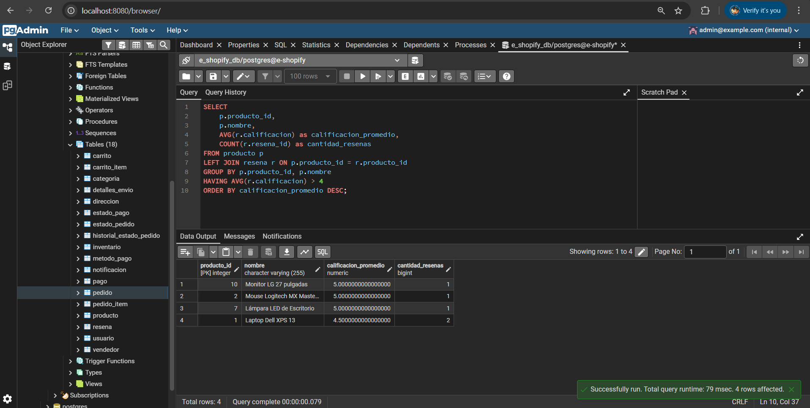

*Figura 10: Captura de pantalla de pgAdmin ejecutando la consulta 5 - productos con alta calificación.*

### 6. Consulta para encontrar los vendedores con más productos vendidos

**Resultado:**
| vendedor_id | nombre_tienda | total_productos_vendidos |
|-------------|---------------|--------------------------|
| 2 | Fashion Hub | 4 |
| 1 | TechStore | 2 |
| 3 | Home Essentials | 1 |

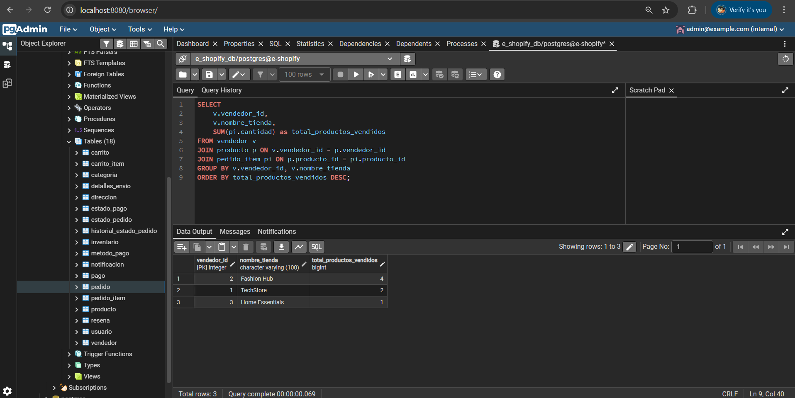

*Figura 11: Captura de pantalla de pgAdmin ejecutando la consulta 6 - vendedores con más ventas.*

Estos resultados confirman que la base de datos está funcionando correctamente y que las consultas SQL recuperan la información esperada. Las capturas de pantalla de pgAdmin pueden incluirse aquí para proporcionar evidencia visual de la ejecución de las consultas.

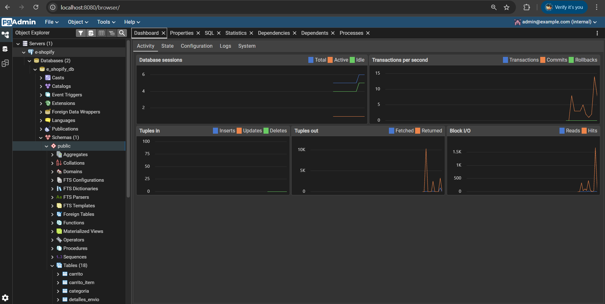

*Figura 5: Panel de control de pgAdmin mostrando la base de datos e-shopify_db activa y lista para consultas.*

## Conclusión

Se implementó exitosamente la base de datos E-Shopify en PostgreSQL, siguiendo las mejores prácticas de normalización y diseño relacional. La estructura incluye todas las entidades necesarias para un sistema de comercio electrónico, con relaciones apropiadas, restricciones de integridad y datos de prueba. Las consultas SQL implementadas demuestran la capacidad de recuperar información compleja y validar la integridad de los datos.

El uso de Docker Compose facilitó el despliegue y la gestión del entorno de desarrollo, permitiendo una implementación reproducible y portable.